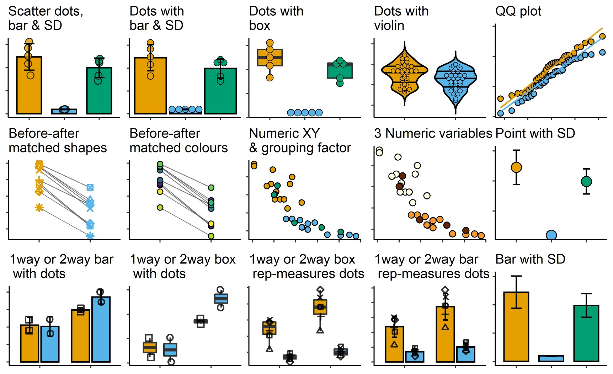
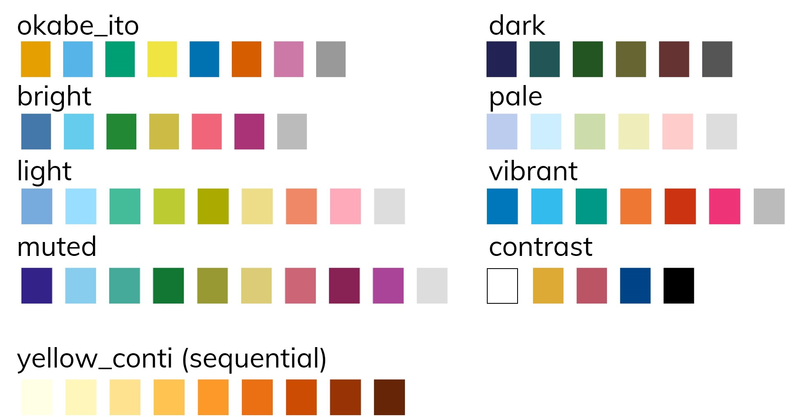

### Installation

To install this package use the following steps. You'll need the package `remotes` installed first, skip to the second step if you already have it.

```{r installation, eval = F, include=T, message=F, warning=F}
install.packages("remotes") #install remotes
remotes::install_github("ashenoy-cmbi/grafify@*release", dependencies = T) #install latest release with dependencies
```

`grafify` depends on `ggplot2`, `lmerTest`, `emmeans`, `car`, `pbkrtest`, `tidyr`, `purrr` and `Hmisc` packages.
 
### Motivation 

```{r, image-1hex, echo = F, out.width="150px"}
knitr::include_graphics("grafify_pptx_small.png")
```


The main goals of this package, besides making it easier for me to share data and functions for the statistics workshop, are the following:

1. easily make common types of graphs based on `ggplot2` but with fewer lines of code
2. carry out ANOVA analysis using linear models and mixed effects
3. perform different kinds of post-hoc comparisons 
4. simulate simple one-way and two-way ANOVA design data

### **Latest version: v0.3.0**

### Features

`grafify` has four main kinds of functions as follows.

1. Making graphs easily using 15 `plot_` functions of 6 broad types

     a. using two variables: `plot_scatterbar_sd`, `plot_dotbar_sd`, `plot_dotbox`, `plot_dotviolin`
     b. using three or four variables: `plot_3d_scatterbar`, `plot_3d_scatterbox`, `plot_4d_scatterbar`, `plot_4d_scatterbox` 
     c. using 3 variables where 2 are quantiative: `plot_xy_NumGroup`, `plot_xy_CatGroup` (new in v0.2.0)
     d. before-after graphs of matched data: `plot_befafter_colours`, `plot_befafter_shapes`
     e. QQ plot to check distribution: `plot_qqline`
     f. summary graphs with SD  error bars: `plot_bar_sd`, `plot_point_sd`
     
  
  
```{r, all-graphs, echo = F, out.width="90%"}

```

The following qualitative and continuous palettes are implemented in `grafify`:


```{r, image-palettes, echo = F, out.width="90%"}

```

(The continuous colour scheme based on Paul Tol's [YlOrBl variant](https://personal.sron.nl/~pault/#sec:sequential) is new in v0.2.0.)
  
2. Fitting linear models and linear mixed models and obtaining ANOVA tables

     a. linear models for ordinary ANOVAs: `simple_anova`, `simple_model`, 
     b. linear mixed effects ANOVAs: `mixed_anova`, `mixed_model`
  
3. Perform post-hoc comparisons based on fitted models
  
     a. `posthoc_Pariwise`
     b. `posthoc_Levelwise`
     c. `posthoc_vsRef`
  
4. Generating random one-way and two-way data based on mean and SD.

     a. one-way designs: `make_1way_data`, `make_1way_rb_data`
     b. two-way designs: `make_2way_data`, `make_2way_rb_data`

5. Colour-blind compatible schemes:
    a. `okabe_ito` (see Mike Mol's [blog](https://mikemol.github.io/technique/colorblind/2018/02/11/color-safe-palette.html)).
    b. `bright`, `pale`, `muted`, `dark`, `light`, `vibrant`, and `contrast`  colours (see Paul Tol's [blog](https://personal.sron.nl/~pault/#sec:qualitative)).

### Vignettes

Visit the `grafify` [vignettes](https://grafify-vignettes.netlify.app) website for detailed examples of usage.


### Companion website

If you're interested in basic stats in R, also visit Statistics for [Micro/Immuno Biologists](https://microimmunostats.netlify.app).

### Release notes

Full reference to all functions available at [`grafify` pages](https://ashenoy-cmbi.github.io/grafify/index.html).

New in v0.3.0

1. A new `plot_4d_scatterbar` function which is like `plot_4d_scatterbox` but plots bar and SD. So there are now two `plot_3d_` and `plot_4d_` functions.
2. Text on X-axis on all graphs can be rotated from 0-90 using `TextXAngle` argument to prevent overlap. 
3. `plot_dot_` functions now have `dotthick` option to set stroke thickness. This is similar to `symthick` for scatter/jitter plots.
4. Using `facet_wrap` or `facet_grid` will not draw a box around panel text (unlike the default in `theme_classic()`).
5. `plot_3d_` and `plot_4d_` functions draw symbols in black colour. 

Fixed in v0.2.1:

1. Bug fixes in `plot_3d_scatterbar` and `plot_3d_scatterbox`, which now correctly use the "shapes" variable to fill colour of bars/boxes and shape of the symbols; symbols are depicted in black.
2. `simple_anova` generates type II ANOVA table through `car::Anova()`, so the `car` package is now a dependency. v0.1.0 and v0.2.0 generated type I ANOVA table through `stats::anova()`. 

New in v0.2.0:

1. the main difference from v0.1.0 is that all `plot_` functions apply the `all_grafify` colour scheme by default (see `plot_` vignettes on how to change colours)
2. two new types of graphs are possible with two quantitative X-Y plots with a third variable that is either numeric (`plot_xy_NumGroup`) or categorical (`plot_xy_CatGroup`).
3. there are two new continuous colour schemes (`scale_fill_grafify_c` and `scale_colour_grafify_c`), based on [Paul Tol's variant](https://personal.sron.nl/~pault/#sec:sequential) of YlOrBl scheme.

