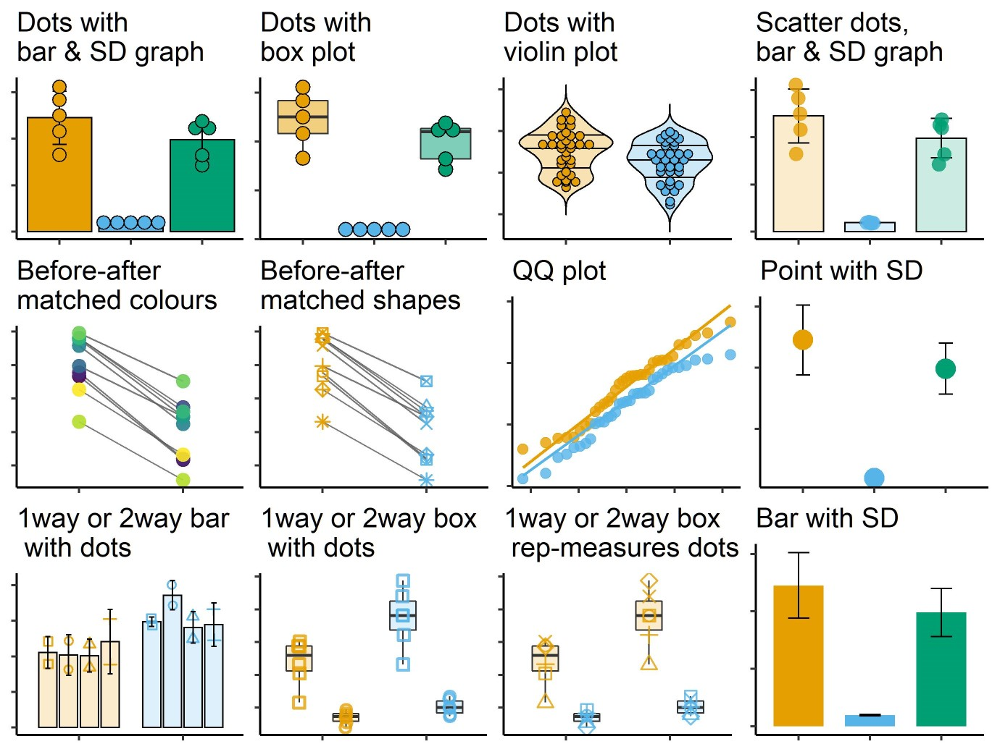

### Installation

To install this package use the following steps. You'll need the package `remotes` installed first, skip to the second step if you already have it.

```{r installation, eval = F, include=T, message=F, warning=F}
install.packages("remotes") #install remotes
remotes::install_github("ashenoy-cmbi/grafify", dependencies = T) #install with dependencies
```

This package requires `dplyr`, `purrr`, `ggplot2`, `lmerTest`, `emmeans` and `Hmisc`. Additionally, `cowplot` and `colorblindr` are suggested packages for making pretty graphs.
 
### Introduction

```{r, image-1hex, echo = F, out.width="150px"}
knitr::include_graphics("grafify_pptx_small.png")
```


The main goals of this package are to make it easier to share data and functions for the statistics workshop, and the following:
1. enable easy grafs based on `ggplot2`
2. carry out ANOVA analysis using linear models and mixed effects
3. perform post-hoc comparisons using `emmeans`
4. make simple one-way and two-way ANOVA design data


This package has four main kinds of functions as follows.

1. Making graphs easily using 12 `plot_` functions of 5 broad types

     a. using two variables: `plot_scatterbar_sd`, `plot_dotbar_sd`, `plot_dotbox`, `plot_dotviolin`
     b. using three or four variables: `plot_3d_scatterbar`, `plot_3d_scatterbox`, `plot_4d_scatterbox`
     c. before-after graphs of matched data: `plot_befafter_colours`, `plot_befafter_shapes`
     d. QQ plot to check distribution: `plot_qqline`
     e. summary graphs with SD  error bars: `plot_bar_sd`, `plot_point_sd`
  
  
```{r, all-graphs, echo = F, out.width="90%"}

```

The following palettes are available.


```{r, image-palettes, echo = F, out.width="90%"}
knitr::include_graphics("Palette_images.jpg")
```

  
2. Fitting linear models and linear mixed models and obtaining ANOVA tables

     a. linear models for ordinary ANOVAs: `simple_anova`, `simple_model`, 
     b. linear mixed effects ANOVAs: `mixed_anova`, `mixed_model`
  
3. Perform post-hoc comparisons based on fitted models
  
     a. `posthoc_Pariwise`
     b. `posthoc_Levelwise`
     c. `posthoc_vsRef`
  
4. Generating random one-way and two-way data based on mean and SD.

     a. one-way designs: `make_1way_data`, `make_1way_rb_data`
     b. two-way designs: `make_2way_data`, `make_2way_rb_data`

5. Colour-blind compatible schemes:
    a. `okabe_ito` colour scheme as described at Mike Mol's [blog](https://mikemol.github.io/technique/colorblind/2018/02/11/color-safe-palette.html).
    b. `bright`, `pale`, `muted`, `dark` and `light` colours described on Paul Tol's [blog](https://personal.sron.nl/~pault/#sec:qualitative).

### Vignettes

Visit the `grafify` [vignettes](https://grafify-vignettes.netlify.app) website for detailed examples of usage.


### Companion website

If you're interested in basic stats in R, also visit Statistics for [Micro/Immuno Biologists](https://microimmunostats.netlify.app).
