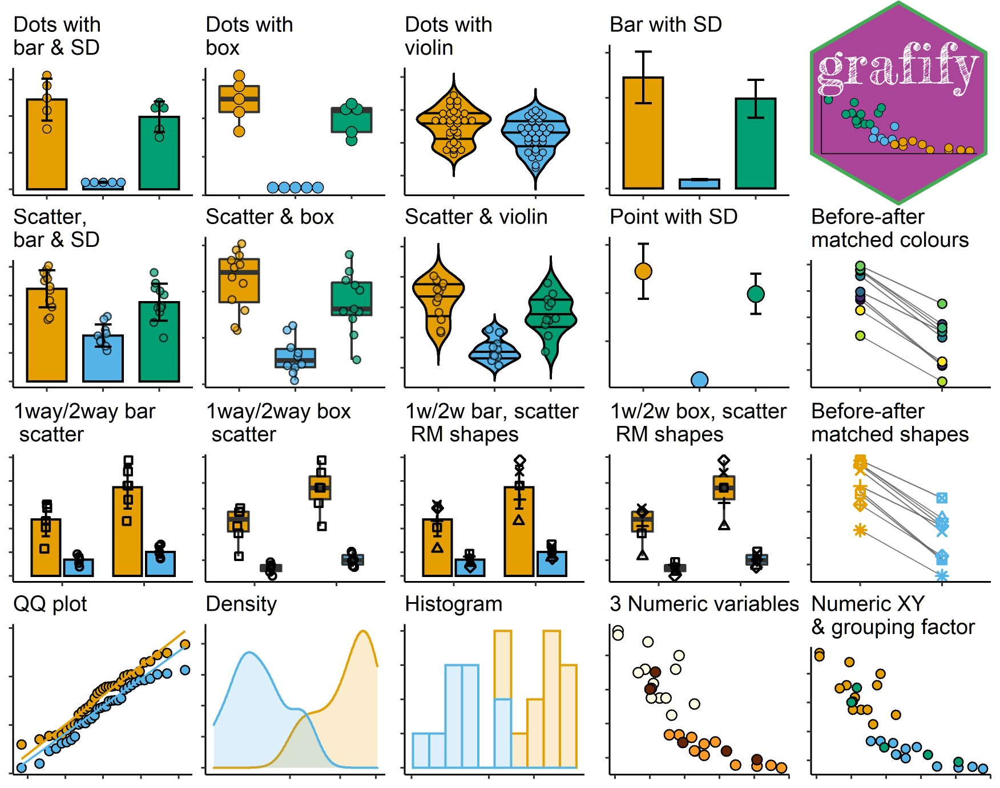

If you use `grafify`, please cite

Shenoy, A. R. (2021) grafify: an R package for easy graphs, ANOVAs and
post-hoc comparisons. Zenodo. <http://doi.org/10.5281/zenodo.5136508>

Latest DOI for all versions:
[](https://doi.org/10.5281/zenodo.5136507)

### Installation

You’ll need the `remotes` package to install `grafify` from GitHub (skip
to the second step if you already have it).

``` r
install.packages("remotes") #install remotes
remotes::install_github("ashenoy-cmbi/grafify@*release") #install latest release 
```

`grafify` requires the following packages to be installed:
`broom.mixed`, `car`, `emmeans`, `ggplot2`, `Hmisc`, `lme4`, `lmerTest`,
`magrittr`, `pbkrtest`, `purrr`, `stats`, `tidyr`.

### Motivation

I made this package mainly to make it easier for making graphs while
exploring data, and to introduce linear models in my teaching using
simpler code and practice data sets.

I mainly wanted to:

1.  make many types of graphs based on `ggplot2` but with far fewer
    lines of code
2.  carry out ANOVA analysis using linear models (`lm`) and mixed
    effects (`lmer`), quickly get ANOVA tables and perform model
    diagnostics
3.  perform post-hoc comparisons (through `emmeans`)
4.  simulate one-way and two-way ANOVA design data for power analysis
    (documentation pending)
5.  use and distribute data & functions for teaching purposes

If you’re interested in basic theory and code for statistics written for
biologists, also visit Statistics for [Micro/Immuno
Biologists](https://microimmunostats.netlify.app).

### **Latest release version: v1.5.1**

### Features

`grafify` has five main features (graphs, colour blind-friendly colour
schemes, ANOVAs & post-hoc comparisons, practice datasets and data
simulations):

1.  There are 19 `plot_` functions of 6 broad types in `grafify`. The
    `plot_scatter..` versions are preferred when there are many data
    points, `plot_dot..` versions have a “cleaner” layout for smaller
    datasets.

    1.  Two categorical variables: these graphs either use scatter (or
        also called jitter) or dot plot geometries:
        `plot_scatterbar_sd`, `plot_scatterbox`, `plot_scatterviolin`
        and `plot_dotbar_sd`, `plot_dotbox`, `plot_dotviolin` **New
        since v1.5.0**: new `plot_` functions like the above but ending
        in `_sc` for *same colour* or *single colour*. See vignettes for
        details.
    2.  Three or four categorical variables (one-way or two-way ANOVA
        desigs): `plot_3d_scatterbar`, `plot_3d_scatterbox`,
        `plot_4d_scatterbar`, `plot_4d_scatterbox`
    3.  Quantitative X & Y, plus a third variable: `plot_xy_NumGroup`,
        `plot_xy_CatGroup`
    4.  Matched before-after graphs: `plot_befafter_colours`,
        `plot_befafter_shapes`
    5.  Data distributions: `plot_qqline`, `plot_density`
        `plot_histogram` **New since v1.5.0**: `plot_qqmodel` which
        generates a Q-Q plot of model residuals
    6.  Summary graphs with SD error bars: `plot_bar_sd`,
        `plot_point_sd` **New since v1.5.0**: *single colour* versions
        of these available as names ending with `_sc`



The following discreet (qualitative) and continuous (quantitative)
palettes are implemented in `grafify`:


(The continuous colour scheme based on Paul Tol’s [YlOrBl
variant](https://personal.sron.nl/~pault/#sec:sequential) is new in
v0.2.0.)

2.  Fitting linear models and linear mixed models and obtaining ANOVA
    tables

    1.  linear models for ordinary ANOVAs: `simple_anova`,
        `simple_model`,
    2.  linear mixed effects for repeated-measures and randomised-block
        design ANOVAs: `mixed_anova`, `mixed_model`,
        `mixed_anova_slopes` & `mixed_model_slopes`.

3.  Perform post-hoc comparisons based on fitted models

    1.  `posthoc_Pariwise`
    2.  `posthoc_Levelwise`
    3.  `posthoc_vsRef`
    4.  `posthoc_Trends`

4.  Generating random one-way and two-way data based on mean and SD and
    residual error.

    1.  one-way designs: `make_1way_data`, `make_1way_rb_data`
    2.  two-way designs: `make_2way_data`, `make_2way_rb_data`

5.  Colour-blind compatible discreet and continuous schemes with
    `scale_fill...` or `scale_colour...` for `ggplot` objects

    1.  `okabe_ito` (see Mike Mol’s
        [blog](https://mikemol.github.io/technique/colorblind/2018/02/11/color-safe-palette.html)),
        `bright`, `pale`, `muted`, `dark`, `light`, `vibrant`, and
        `contrast` colours (see Paul Tol’s
        [blog](https://personal.sron.nl/~pault/#sec:qualitative)).
    2.  Continuous colour scheme available through
        `scale_fill_grafify_c` and `scale_colour_grafify_c`.

### Vignettes

Visit the `grafify` [vignettes](https://grafify-vignettes.netlify.app)
website for detailed examples of usage.

### Hexsticker


### Status

<!-- badges: start -->

[](https://github.com/ashenoy-cmbi/grafify/actions)
