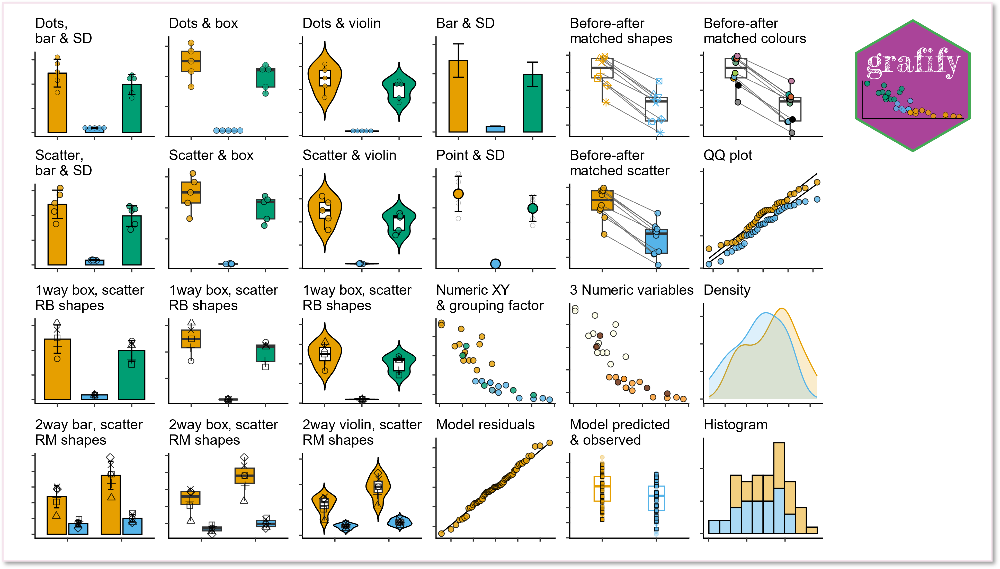
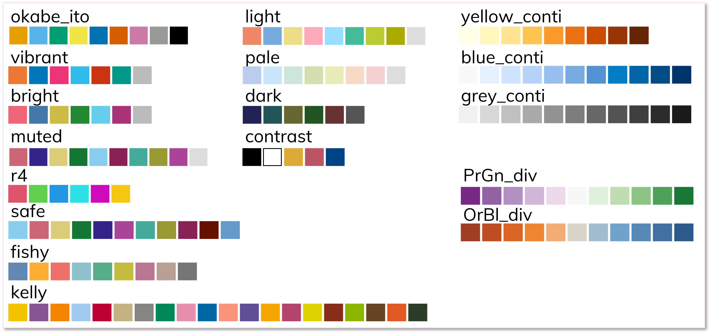

### Features

`grafify` has three main features:

1.  plotting great-looking graphs for quick-n-easy data exploration with
    few lines of code
2.  apply colour blind-friendly palettes to graphs plotted with
    `grafify` or `ggplot2`
3.  use linear models for ANOVA (including those with randomised block
    designs and repeated-measures) & post-hoc comparisons (estimated
    marginal means, confidence intervals and *P* values)

The [vignettes website](https://grafify-vignettes.netlify.app) has
detailed help on usage and latest [release notes are
here](https://grafify-vignettes.netlify.app/release_notes.html).

As an example, you could write this to plot bar/SD graph from a 2-way
ANOVA data with randomised blocks:

``` r
plot_4d_scatterbar(data = data_2w_Festing, 
                   xcol = Strain,
                   ycol = GST,
                   bars = Treatment,
                   shapes = Block)
```


instead of all this!

``` r
ggplot2::ggplot(data = data_2w_Festing,
       aes(x = Strain,
           y = GST,
           group = interaction(Strain,
                               Treatment)))+
  stat_summary(geom = "bar",
               aes(fill = Treatment),
               position = position_dodge(width = 0.8), 
               fun = "mean")+
  geom_point(aes(shape = Block),
             size = 3, stroke = 1,
             position = position_jitterdodge(jitter.width = .2,
                                            dodge.width = .8))+
  stat_summary(geom = "errorbar",
               width = .2, size = 1,
               fun.data = "mean_sdl",
               fun.args = list(mult = 1),
               position = position_dodge(width = 0.8))+
  scale_shape_manual(values = 21:22)+
  theme_classic(base_size = 21)+
  theme(axis.text.x = element_text(angle = 45, hjust = 1))+
  scale_fill_manual(values = c(as.vector(graf_palettes$okabe_ito[1:2])))
```

Two other features including practice datasets (with randomised blocks),
and data simulation for power analyses. The first three features are
better documented at present.

#### Graphs

1.  Easily plot data as scatter/dot plots with boxes, violins or bars
    with `plot_` functions of 6 broad types.

    1.  Two variables (one categorical & one numeric): these graphs
        either use scatter (or also called jitter) or dot plot
        geometries: `plot_scatterbar_sd`, `plot_scatterbox`,
        `plot_scatterviolin` or `plot_dotbar_sd`, `plot_dotbox`,
        `plot_dotviolin`
    2.  One-way or two-way ANOVA designs with or without randomised
        blocks (3 or 4 dimensions or variables): `plot_3d_point_sd`,
        `plot_3d_scatterbar`, `plot_3d_scatterbox`,
        `plot_3d_scatterviolin` or `plot_4d_point_sd`,
        `plot_4d_scatterbar`, `plot_4d_scatterbox`,
        `plot_4d_scatterviolin`
    3.  Matched before-after graphs: `plot_befafter_colours`,
        `plot_befafter_shapes`, `plot_befafter_box`  
    4.  Quantitative X & Y, plus a third variable: `plot_xy_NumGroup`,
        `plot_xy_CatGroup`
    5.  Data distributions: `plot_qqline`, `plot_density`
        `plot_histogram`, and model diagnostics with `plot_qqmodel`,
        `plot_qq_gam`, `plot_lm_predict` and `plot_gam_predict`
    6.  Graphs with SD, SEM or CI95 error bars: `plot_point_sd`,
        `plot_scatterbar_sd`, `plot_3d_scatterbar`



#### Colourblind-friendly colour schemes

The following 12 categorical (qualitative/discreet) and 5 quantitative
(3 sequential and 2 divergent) palettes are implemented in `grafify` for
making graphs with `plot_` functions.

In addition, `scale_fill_grafify` and `scale_colour_grafify` functions
can be used to apply all `grafify` palettes to any `ggplot2` object.



All palettes are colourblind-friendly. (See Mike Mol’s
[blog](https://mikemol.github.io/technique/colorblind/2018/02/11/color-safe-palette.html)
and Paul Tol’s [blog](https://personal.sron.nl/~pault/#sec:qualitative).
Additional colour schemes were chosen from [`cols4all`
package](https://github.com/mtennekes/cols4all)).

#### `grafify` theme & adding log-scales

The `theme_grafify` function is a modification of `theme_classic` and
enables graphs plotted with `ggplot2` to have a `grafify`-like
appearance.

`plot_logscales` lets you take any `ggplot2` object and transform Y, X
or both axes into `log2` or `log10` values, and latter will also show
log10 tick marks.

#### Linear models for ANOVA

Get ANOVA tables and linear models with these easy wrappers.

1.  linear models for ordinary ANOVA: `simple_anova`, `simple_model`,
    `ga_model`, `ga_anova`.
2.  linear mixed effects for repeated-measures and randomised-block
    design ANOVA: `mixed_anova`, `mixed_model`, `mixed_anova_slopes`,
    `mixed_model_slopes`, `ga_model`, `ga_anova`.
3.  plot model residuals with `plot_qqmodel` and `plot_qq_gam`.
4.  plot model predictions with `plot_lm_predict` and
    `plot_gam_predict`.

#### Post-hoc comparisons & Estimated Marginal Means (easy wrappers for `emmeans`)

Perform post-hoc comparisons based on fitted models for response
variables and slopes. Get Estimated Marginal Means, *P* values,
parameter estimates with CI95 with these wrappers.

1.  `posthoc_Pariwise`, `posthoc_Levelwise` & `posthoc_vsRef`
2.  `posthoc_Trends_Pairwise`, `posthoc_Trends_Levelwise` &
    `posthoc_Trends_vsRef`

#### Data simulation

Generating random one-way and two-way data based on mean and SD and
residual error.

1.  one-way designs: `make_1way_data`, `make_1way_rb_data`
2.  two-way designs: `make_2way_data`, `make_2way_rb_data`

#### Data summaries

`table_summary` is simple function to obtain mean, median and SD by
groups, and `table_x_reorder` is for working with factors.

### Vignettes

The best place to see `grafify` in action is the
[vignettes](https://grafify-vignettes.netlify.app) website, which has
detailed description of all functions.

### **Latest version: v4.0.1 on CRAN or GitHub**

Find out about [latest updates
here](https://grafify-vignettes.netlify.app/release_notes.html).

### Citing `grafify`

Shenoy, A. R. (2021) grafify: an R package for easy graphs, ANOVAs and
post-hoc comparisons. Zenodo. <http://doi.org/10.5281/zenodo.5136508>

Latest DOI for all versions:
[](https://doi.org/10.5281/zenodo.5136507)

### Installation

`grafify` is now on [CRAN](https://CRAN.R-project.org/package=grafify)
and can be installed by typing `install.packages("grafify")`.

Any updates not yet on CRAN will be made available here first. To
install from GitHub you also need to install the `remotes` package. Then
type `remotes::install_github("ashenoy-cmbi/grafify@*release")`.

`grafify` requires the following packages to be installed: `car`,
`emmeans`, `ggplot2`, `Hmisc`, `lme4`, `lmerTest`, `magrittr`, `mgcv`,
`patchwork`, `purrr`, `stats`, `tidyr`.

### Motivation behind `grafify`

I made this package mainly for exploring data by quickly making graphs
of different types. Secondly, to implement linear regressions for ANOVA.
I also use it to introduce linear models in my teaching, including the
analyses of randomised block designs to new users.

### Statistics for Micro/immuno biologists

Also visit Statistics for [Micro/Immuno
Biologists](https://microimmunostats.netlify.app) for basic statistics
theory and data analyses in R.

### Function references

Go to this [website](https://ashenoy-cmbi.github.io/grafify/index.html)
for function documentations.

### Hexsticker


### Status

<!-- badges: start -->

[](https://github.com/ashenoy-cmbi/grafify/actions)
