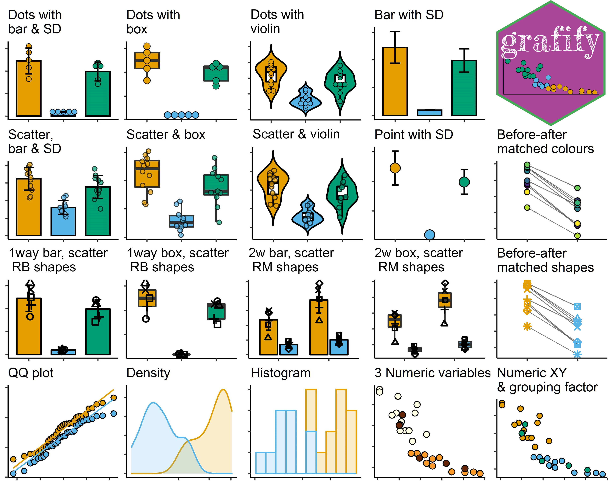
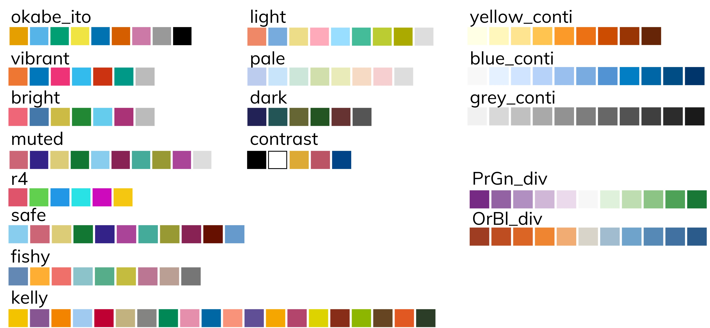

### Features

`grafify` has five main features:

1.  plotting great-looking graphs for quick-n-easy data exploration
2.  apply colourblind-friendly palettes to graphs plotted with `grafify`
    or `ggplot2`
3.  use linear models for ANOVA & post-hoc comparisons (estimated
    marginal means, confidence intervals and *P* values)
4.  practice datasets (with randomised blocks)
5.  simulating data for power analysis

#### Graphs

1.  Easily plot data as scatter/dot plots with boxes, violins or bars
    with `plot_` functions of 6 broad types.

    1.  Two variables (one categorical & one numeric): these graphs
        either use scatter (or also called jitter) or dot plot
        geometries: `plot_scatterbar_sd`, `plot_scatterbox`,
        `plot_scatterviolin` or `plot_dotbar_sd`, `plot_dotbox`,
        `plot_dotviolin`
    2.  One-way or two-way ANOVA designs with or without randomised
        blocks (3 or 4 dimensions or variables): `plot_3d_scatterbar`,
        `plot_3d_scatterbox` or `plot_4d_scatterbar`,
        `plot_4d_scatterbox`
    3.  Matched before-after graphs: `plot_befafter_colours`,
        `plot_befafter_shapes` c. Quantitative X & Y, plus a third
        variable: `plot_xy_NumGroup`, `plot_xy_CatGroup`
    4.  Data distributions: `plot_qqline`, `plot_density`
        `plot_histogram`, and residuals of linear models with
        `plot_qqmodel`
    5.  Summary graphs with SD error bars: `plot_bar_sd`,
        `plot_point_sd`

#### Colourblind-friendly colour schemes

The following categorical (qualitative/discreet) and quantitative
(sequential or divergent) palettes are implemented natively in `grafify`
(i.e. can be applied to `plot_` objects from within the function call.

`grafify` also offers `scale_fill_grafify` and `scale_colour_grafify` to
apply all `grafify` palettes to any `ggplot2` object.

All palettes are colourblind-friendly. (See Mike Mol’s
[blog](https://mikemol.github.io/technique/colorblind/2018/02/11/color-safe-palette.html)
and Paul Tol’s [blog](https://personal.sron.nl/~pault/#sec:qualitative).
Additional colour schemes were chosen/adapted from [`cols4all`
package](https://github.com/mtennekes/cols4all)).

#### Linear models

Fitting linear models or linear mixed effects models, and obtaining
ANOVA tables with easy wrappers around `lme4`.

1.  linear models for ordinary ANOVA: `simple_anova`, `simple_model`,
2.  linear mixed effects for repeated-measures and randomised-block
    design ANOVA: `mixed_anova`, `mixed_model`, `mixed_anova_slopes` &
    `mixed_model_slopes`.

#### Post-hoc comparisons & Estimated Marginal Means (easy wrappers for `emmeans`)

Perform post-hoc comparisons based on fitted models for response
variables and slopes. Also get Estimated Marginal Means with these
wrappers.

1.  `posthoc_Pariwise`, `posthoc_Levelwise` & `posthoc_vsRef`
2.  `posthoc_Trends_Pairwise`, `posthoc_Trends_Levelwise` &
    `posthoc_Trends_vsRef`

#### Data simulation

Generating random one-way and two-way data based on mean and SD and
residual error.

1.  one-way designs: `make_1way_data`, `make_1way_rb_data`
2.  two-way designs: `make_2way_data`, `make_2way_rb_data`

### Vignettes

The best place to see `grafify` in action is the
[vignettes](https://grafify-vignettes.netlify.app) website, which has
detailed description of all functions.

### **Latest version: v2.3.0 on CRAN or GitHub**

### Citing `grafify`

Shenoy, A. R. (2021) grafify: an R package for easy graphs, ANOVAs and
post-hoc comparisons. Zenodo. <http://doi.org/10.5281/zenodo.5136508>

Latest DOI for all versions:

### Installation

`grafify` is now on [CRAN](https://CRAN.R-project.org/package=grafify)
and can be installed by typing `install.packages("grafify")`.

Any updates not yet on CRAN will be made available here first. To
install from GitHub you also need to install the `remotes` package. Then
type `remotes::install_github("ashenoy-cmbi/grafify@*release")`.

`grafify` requires the following packages to be installed: `car`,
`emmeans`, `ggplot2`, `Hmisc`, `lme4`, `lmerTest`, `magrittr`,
`pbkrtest`, `purrr`, `stats`, `tidyr`.

### Motivation behind `grafify`

I made this package mainly for exploring data by quickly making graphs
of different types. Secondly, to implement linear regressions for ANOVA.
I also use it to introduce linear models in my teaching, including the
analyses of randomised block designs to new users.

### Statistics for Micro/immuno biologists

Also visit Statistics for [Micro/Immuno
Biologists](https://microimmunostats.netlify.app) for basic statistics
theory and data analyses in R.

### Function references

Go to this [website](https://ashenoy-cmbi.github.io/grafify/index.html)
for function documentations.

### Hexsticker

### Status

<!-- badges: start -->

